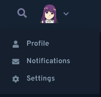
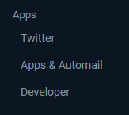
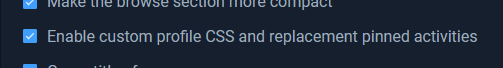
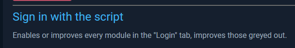

<div align="center">

# Custom CSS on AniList!

Yes, you heard me right. While it's a little hacky, it definitely works!

How do you do it, you ask? That's why I'm here. Here are the steps.

<hr>

```ocaml
1. GET A USERSCRIPT MANAGER
```

I recommend using Tampermonkey for this.

[FIREFOX]() | [CHROME]()

```ocaml
2. GET AUTOMAIL
```

[Automail](https://github.com/hohMiyazawa/Automail) is the userscript we're going to be using. It's made by [hoh](https://github.com/hohMiyazawa/). It allows for lots of customization within AniList, one being the custom CSS we're looking for.

[GET AUTOMAIL (Greasy Fork)](https://greasyfork.org/en/scripts/370473-automail)

```ocaml
3. ENABLE CUSTOM CSS
```

Great, we have Automail. Now, just follow these images I made to enable custom CSS:

Go to your `Settings` page<br>


Go to the `Apps & Automail` menu<br>


Find this checkbox and make sure it's on:<br>


```ocaml
4. LOG IN WITH THE SCRIPT [OPTIONAL]
```

Follow the first two images of the previous step, and find this link on the bottom of the page:<br>


```ocaml
5. PROFIT
```

You have custom CSS! Along with a bunch of options you can tweak to your heart's content. Have fun!

</div>
