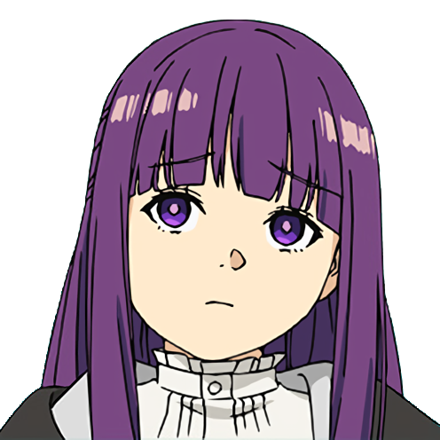

<h1>AniList Frieren CSS</h1>
<i>Beyond Journey's End.</i>

<br><br>

<hr>

## About

Just a theme for a couple people that are a little too hyped about an anime.

All the code is inside the `src` folder.

## Inspirations

- [Frieren website](https://frieren-anime.jp/)
- [The manga](https://anilist.co/manga/118586/Sousou-no-Frieren/)
- [The anime](https://anilist.co/anime/154587/Sousou-no-Frieren/)

## How-to

### CSS

<div align="center">

```ocaml
POWERED BY SCSS AND LOTS OF BLACK MAGIC
```

</div>

1. Get [Bun](https://bun.sh).
2. Clone the repo
3. Run `bun install`
4. Run `bun run compile`
5. The CSS will be output to `dist`

### Bio thingy

<div align="center">

```ocaml
POWERED BY BUN AND VERY BAD CODE
```

</div>

<i>You will probably never need this. I only made it so I can generate the AL-friendly version of the bio, so it doesn't render linebreaks on our profiles.

This is absolutely not something you should be using instead of an actual well made minifier.</i>

1. Get [Bun](https://bun.sh).
2. Clone the repo
3. Run `bun install`
4. Run `bun run index.ts` or `bun run bio`
5. The minified version of `bio.html` will be in the same folder named `bio.min.html`

## License

MIT License. Please credit me if you use my CSS for inspiration.
